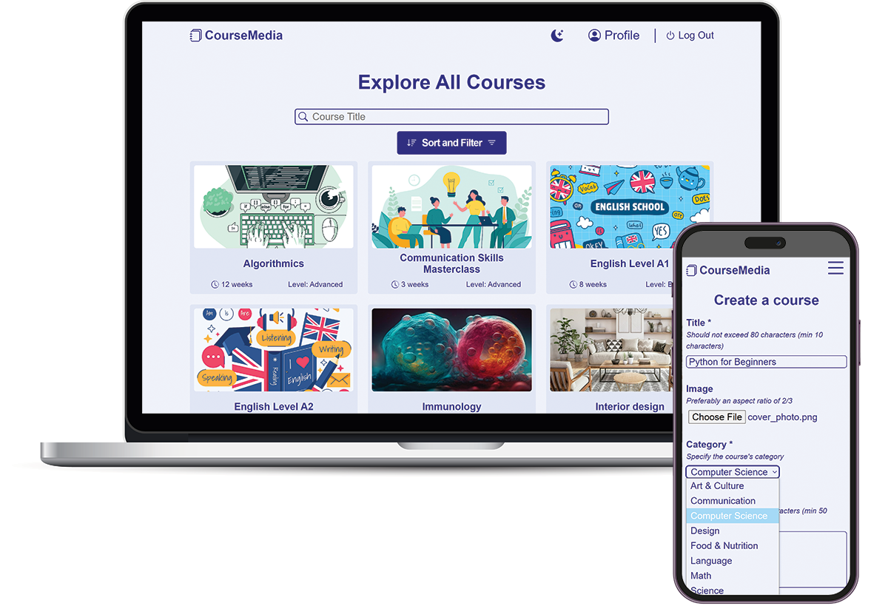

# _CourseMedia_: An Online Courses Web Application built with Python and JavaScript

## Table of Content

1. [Introduction](#1-introduction)
1. [Database design](#2-database-design)
1. [About this web application](#3-about-this-web-application)
1. [How to run this application](#4-how-to-run-this-application)

## 1. Introduction

This web application consists of an online courses platform, where instructors can create courses with their corresponding quizzes, and students can enroll in those courses and take their quizzes: they pass or fail depending on the grade they have got. For specific courses, a certificate is granted upon completion and can be downloaded by the students. Every user has their own profile in which (depending on the user's role) several actions can be performed.

## 2. Database design

Using Django ORM, 2 models are defined: User model and Course model. The fields in every model and the relationship between them is shown in the figure below.

## 3. About this web application

I will start by talking about some components in the web app that are common in all web pages.

- **Header Menu:** The header menu contains links that may change from a web page to another, and if there is a logged in user or not. The header menu is responsive: on small screen sizes it collapses into a hamburger menu.

- **Footer:** a basic footer with dummy infos that is always placed on the bottom of any page even when the page's content doesn't fill the page.

- **Courses Representation:** Every course in this web application is represented by a card, that displays the course's image, title, duration and level. When the card is clicked, users are taken to the **course page**.

In the following section, I will list all the web pages of this web app, and I will explain what each web page consists of.

- **Index Page:** Contains the following sections:
  - The first section greets the user, or provides a sign in / sign up link if no user is logged in.
  - "Our Top Courses section", that displays the 6 courses that have the most enrolled students. An `Explore All Courses` button takes users to the **all courses page**.
  - "About us" and "Connect With Us" sections.

* **Sign In Page:** Users type their username and password to sign in. There is a "Forgot your password?" link that let users reset their passwords.

* **Sign Up Page:** to sign up, users should provide their: first name, last name, username, email. They should also specify their role (student or instructor), and only if they choose the instructor option, the "Title" field appears, where instructors should specify their titles (i.e. Software Engineer at Example Company). Lastly, there is the "about Me" section, where users should introduce themselves and talk about their interests.

* **All Courses Page:** this page displays all courses available on the platform. Courses are sorted alphabetically (A->Z) by default.

  - Users can **search** for courses by _title_, by typing in a search query.
  - Users can **sort** courses _alphabetically from A->Z_, _alphabetically from Z->A_, by _most recent_ (depending on the course's creation date) and by _popularity_ (from the course with the highest number of enrolled students, to the least one).
  - Users can **filter** courses by _category_, _duration_, _language_ and _level_. More than one filter option can be applied at the same time.

    All 3 features work together, i.e. users can apply sort **and** filter options together at the same time, and if there is a search query typed, this will be taken into consideration before displaying to the user the sorted and/or filtered courses.

* **Course Page:** this page contains all information related to the course.
  First, here is the list of elements of that page that are always displayed, wether there is no logged in user, or wether the logged in user is a student or an instrutor:

  - Image
  - Title
  - Small description
  - Total number of students enrolled
  - Duration
  - Level
  - Language of teaching
  - If a certificate upon completion is provided or not
  - About this course, which is a detailed description of the course's content
  - Prerequisite: which is another course teached by the same instructor. Users can click on the prerequisite course and see its page.
  - Instructor: Users can click on the instructor name and go to its profile page.

  **If there is no logged in user:**

  - a `Log In to Enroll` button that takes users to the sign in page.

  **If the logged in user is a student:**

  - Similar courses section (if any): Only if there are courses from the same category, this section is displayed and contains 3 courses from the same category.

    **if the student is not enrolled in that course:**

    - an `Enroll Now` button: when clicked, the logged in user becomes enrolled in that course.

    **if the student is enrolled in that course:**

    - `Go to Course Content` button that takes the student to the course's content (this button is not functional for now, as I did not inlude courses contents for this project).

      **if the student did not take/pass the quiz yet:**

      - `Take the quiz` button that takes the student to the course's quiz page.

      **if the student passed the quiz of that course:**

      - "You completed this course!" phrase
      - `Download Certificate` button: when clicked, a certificate (PDF file) is downloaded for the user. For more infos on the implementation of this feature, see the fifth section in [Distinctiveness and Complexity](#2-distinctiveness-and-complexity) section above.

  **If the logged in user is an instructor:**

  - **if the instructor is the creator of that course:**

    - `Go to Course Content` button that should take the instructor to the course's content.
    - "Enrolled Students" section: this section contains a table created with [DataTables](https://datatables.net/). This table lists the usersame, first name and last name of all enrolled students. Instructors can click on a username and go to the student's profile page. Additionally, it shows the status of every enrolled student: if the student passed the quiz of that course, "Passed" is displayed. Otherwise "Enrolled" is displayed.

  - **if the instructor is not the creator of that course:** the view of that page is similar to the view if there is no logged in user, but without the `Log In to Enroll` button.

* **Instructor Profile Page:** There are 2 views for that page: the instructor is visiting their own profile page, or any other user accessing that page. Both views have the same components, which are the details about the instructor: the full name (followed by a medal icon if the instructor have 4+ enrolled students on the total of their courses), title, "about me", as well as the listing of the courses taught by that instructor. When the instructor visits their own profile, there are 2 additional buttons: `Edit Profile` which takes to the **Edit Profile Page**, and `New Course` which takes to the **Create Course Page**.

* **Create Course Page:** in that page, instructors can create a new course. They should specify its attributes such as the title, duration, level, etc., as well as a prerequisite: they choose one of the courses they teach to be a prerequisite for that new course. In addition to that, there is the "Create a Quiz" section. Instructors should create a quiz that consists of single choice questions. First, they specify the passing grade in percentage. Then they start by filling informations related to the first question of that quiz: question body, options (comma seperated), the index of the correct option. After that, instructors can add as many questions as they want, by clicking on the `Add a question` button. Every time this button is clicked, a new question section appears. The `Publish Course` button should be clicked to publish the course.

* **Quiz Page:** by clicking on the `take the quiz` button from a course's page, the student will be taken to the quiz page. On that page, the student can read the instructions of the quiz and the passing grade. After that, every question is displayed followed by its options, and students can only choose one option. Students click on the `Submit` button to submit their responses. 2 scenarios can happen here:

  - **Fail The Quiz:** the grade of the student is displayed, followed by `retake the quiz` button that re-display the quiz. Students can retake the quiz as many times as needed until they pass it. There is also a link that takes the student back to the course's page.
  - **Pass The Quiz:** A confetti animation starts and lasts for 5 seconds. The grade of the student is displayed, followed by a link to go back to the course's page.

* **Student Profile Page:** the student's profile page displays the first name and last name, followed by a trophy icon if the student completed 2+ courses. Next, there is the month and year of joining the platform and the about me section. When students visit their own profile, there is the additional `Edit Profile` button which takes to the **Edit Profile Page**. There is also 2 sections in that page:

  - **Completed courses:** the number of completed courses is displayed. If that number is greater than 0, a maximum of 2 completed courses titles (on small screens) or cards (on bigger screens) are displayed. If there are more than 2 completed courses, a _See all completed courses_ link will be displayed. This link takes to the **completed courses page** where all completed courses cards are displayed. At the top of that page, there is a link that takes users back to the student profile page.
  - **Currently enrolled courses:** the number of enrolled but not passed courses is displayed. The display of this section is similar to the completed courses section.

* **Edit Profile Page:** the `Edit Profile` button takes students or instructors to that page. They can edit their first name, last name, title (for instructors), and their "about me" section. Username and email fields are present as disabled fields that can not be edited. When the `Save Changes` button is clicked, the changes are saved in the database.

## 4. How to run this application

- Clone this repository
- `cd` into the root directory (E-Learning-Platform)
- Run the following command: `pip install -r requirements.txt`
- And finally, run the following command: `python manage.py runserver` and open the provided url in your browser

  I will provide 2 account credentials to sign in:

  - **An instructor account:** username: Christopher and Password: christopher
  - **A student account:** username: Jad and Password: jad

    Please note that the first letter of both usernames starts with an uppercase letter, however the first letter of both passwords starts with a lowercase letter.
