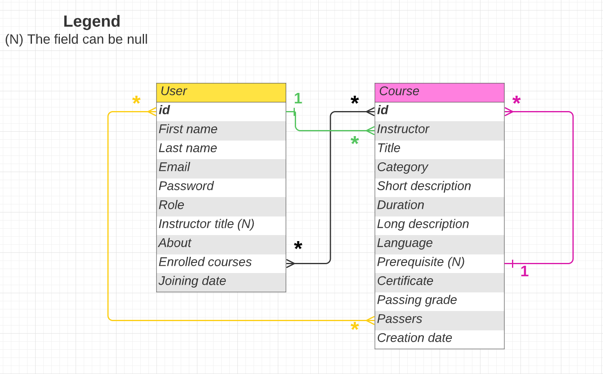

## CS50's Web Programming with Python and JavaScript

# Project 5 - Capstone

# _CourseMedia_: An Online Courses Platform

Insert table of content here

This web application consists of an online courses platform, where instructors can create courses and their appropriate quiz, and students can enroll in those courses and pass them if they get a grade equal or above the passing grade defined by the instructor.

## 1. Distinctiveness and Complexity

In order to prove the **distinctiveness** and **complexity** of this project compared to the previous 5 projects of this course, I will list 10 key features I implemented:

- **Forget Password Feature:** I learned how to implement the forget password feature. From specifying the 4 url paths Django provides for this feature along with their appropriate views functions, to customizing their 4 appropriate HTML templates, all the way to customizing the email template that is sent to users. Lastly, I ran an SMTP server on the console in order to test this whole process (by specifying EMAIL_BACKEND in settings.py).

- **Used a custom user model:** For the user model, I inherited from `AbstractUser()` class, and I added some extra user information in the same model. For that reason, I specified `REQUIRED_FIELDS`, which is "_a list of the field names that will be prompted for when creating a user via the createsuperuser management command_" (as mentioned [here](https://docs.djangoproject.com/en/4.2/topics/auth/customizing/)). This list should include any field name that can not be blank, in order to avoid errors while creating the superuser.

- **Let users upload an image:** I learned how to add the feature of file upload in my web application. From specifying to Django in which directory I want to store the uploaded files (specify both `MEDIA_ROOT` in `settings.py` and `upload_to()` parameter in `ImageField()` class in the model), to specifying the url to access the uploaded file (`MEDIA_URL` in `setting.py`), all the way to setting the `enctype` attribute inside the form tag in HTML to `multipart/form-data`.

- **Compress images before saving them:** I overrode the save function in a Django Model and used the `Pillow` python module in order to compress uploaded images before saving them.

- **Create a pdf file and let users download it:** I learned how to use the `ReportLab` Python library in order to create a pdf file. Then I used Django's `FileResponse()` class with its `as_attachment` parameter set to True, in order to "_ask the browser to offer the file to the user as a download_" (as mentioned [here](https://docs.djangoproject.com/en/4.2/ref/request-response/)).

- **Sort, Filter and Search Features:** In one of my web pages, where all objects of a given model are displayed, I implemented a complex sort/filter/search feature using API call with Javascript, a Django views function to describe what should happen when that API is called, and the HTML template tag to display sorted and filtered objects.
  When sort and/or filter are applied by the user, I gather the sort and filter options selected and I make an API call with the sort and filter informations as GET parameters in the url. In the backend, I extract the sort and filter informations and as a response, I send a JsonResponse containing sorted and filtered serialized objects. When the API response is recieved in JavaScript, I populate, for every object, the content of the template tag created in HTML in order to add the sorted and filtered objects in the DOM.
  Lastly, I take into consideration the search query typed by the user (if there is any) to decide which objects to display on the web page.

- **Used [DataTables](https://datatables.net/) to create interactive and responsive HTML tables:** I learned how to use DataTables (which requires jQuery) to make a more interesting table, both on the design level and feature level, as DataTables applies a certain styling and enables sorting, filtering and searching within the data of the table. But the default styling and features wasn't enough for me, so I also learned [data rendering](https://datatables.net/examples/basic_init/data_rendering.html), which helped me customise how the data will be displayed in the cells (changing text color, adding links to the text), as well as specifying what information DataTables will use in order to sort and filter the data of the table.

- **Create dynamic form, saving its data in JSON format and represent this JSON data in an HTMl file:** Using JavaScript and the `template` tag in HTML, I was able to create a dynamic form in one of my web pages. In fact, there is a button at the end of the form, everytime it is clicked, a new section of the form is displayed.
  When the form is submitted, I extract all field values, apply some checking, merge them into a single data structure which is then saved to a JSON file.
  In a certain point in the web application, I load the content of the JSON file into a python dictionary and I represent that data in an HTML file.

- **Responsive web application:** This web application is fully responsive, as I used CSS media queries to adapt the styling of my web application on different viewport sizes, from mobiles to screens above 1536px wide.

- **Light mode / dark mode:** Users can switch between Light mode and dark mode depending on their preference.

## 2. What’s contained in each file I created

E-Learning-Platform is the base directory. Here is the listing of the files/directories I created/added code in it:

- **README.md**
- **quizes directory:** this directory contains the quizes files in JSON format. Every file is named by the {course instructor's username}\_{course id}.
- **media directory:** this directory contains 2 sub-directories:
  - **certificate_images directory:** contains 2 image files that are necessary when I generate a course's certificate pdf file.
  - **courses_images directory:** every course has its own image. These images are stored in this directory.
- **elearning directory:** it's the directory of the Django project. The 2 files in this directory in which I added some code are:
  - **settings.py:** I mainly specified the `MESSAGE_TAGS` dictionary, in which I assigned each Django message tag with a corresponding class. I also specified `MEDIA_ROOT` and `MEDIA_URL` for the upload files functionality, and `QUIZES_ROOT` to specify in which directory to store the courses' quizes. Finally I specified `EMAIL_BACKEND` for running an SMTP server on the console.
  * **urls.py:** In that file, I specified the path to my Django application.
- **courses_platform directory:** it's the directory of this django app. It contains:
  - **static/courses_platform directory:** In this directory, there is the css and js files divided between 2 directories: `components` directory which contains css and js files related to some components of a specific web page, and `pages` directory in wich there are css and js files responsible of a whole web page.
    Additionaly, in the static/courses_platform directory there are 3 css files:
    - **modern-normalize.css:** Normalize browsers' default style. Includes only normalizations for the latest Chrome, Firefox, and Safari ([source](https://github.com/sindresorhus/modern-normalize)).
    - **styles.css:** in this file I defined variables for font size and colors, and I applied styling to various HTML elements: body, input, textarea, select, button, image, and anchor.
    - **utils.css:** in this file, I mainly specified the styling of "my-container" class on different viewport sizes, which is a class given to the div element that wraps the entire body content of every web page in this web app.
  * **templates/courses_platform directory:** this directory contains all the html files of every web page in this web app, along with one directory named `includes` which contains messages.html where there is the html code of success/error/warning messages that appear to the user.
  * **urls.py:** in this file, I specified all the paths required for my web app, along with their appropriate views function name, and their appropriate name.
  * **views.py:** in this file, I defined all Django forms I need for my web app. Also, every views function is defined in this file.
  * **models.py:** in this file, I defined 2 models: User model and Course model. The fields in every model and the relationship between them is shown in the figure below.
    
  * **admin.py:** in this file, I specified for every model, what fields to show in the admin interface.
  * **tests.py:** in this file, I defined tests that aim to test the models I created.

## 3. How to run the application

- Clone this repository
- `cd` into the root directory
- Run the following command: `pip install -r requirements.txt`
- And finally, run the following command: `python manage.py runserver` and open the provided url in your browser

  I will provide 2 account credentials to sign in:

  - **An instructor account:** username: Christopher and Password: christopher
  - **A student account:** username: Jad and Password: jad

    Please note that the first letter of both usernames starts with an uppercase letter, however the first letter of both passwords starts with a lowercase letter.

## 4. About my web application

I will start by talking about some components in my web app that are common in all web pages.

- **Header Menu:** The header menu contains links that may change from a web page to another, and if there is a logged in user or not. The header menu is responsive: on small screen sizes it collapses into a hamburger menu.

- **Footer:** a basic footer with dummy infos that is always placed on the bottom of any page even when the page's content doesn't fill the page.

- **Courses Representation:** Every course in my web application is represented by a card, that displays the course's image, title, duration and level. When the card is clicked, users are taken to the appropriate course page.

In the following section, I will list all the web pages of my web app, and I will explain what each web page consists of.

- **Index Page:** this is the main page of this web app. It contains the following sections:
  - The first section greets the user, or provides a sign in / sign up link if no user is logged in.
  - Next, there is the "Our Top Courses section", that displays the 6 courses that have the most enrolled students. An "Explore All Courses" button takes users to the all courses page (see below)
  - Lastly there is the "About us" and "Connect With Us" sections.

* **Sign In Page:** Here, users type their username and password to sign in. There is a "Forgot your password?" link that let users reset their passwords. (see Distinctiveness and Complexity section for implementation details)

* **Sign Up Page:** to sign up, users should provide their: first name, last name, username, email. They also should specify their role (student or instructor), and only if they chose the instructor option, the "Title" field appears, where instructors should specify their titles (i.e. Software Engineer at Example Company). Lastly, there is the "about Me" section, where users should introduce themselves and talk about their interests.

* **All Courses Page:** this page displays all courses available on the platform. Courses are sorted alphabetically by default (A->Z).

  - Users can **search** for courses by their title, by typing in a search query.
  - Users can **sort** courses alphabetically from A->Z, alphabetically from Z->A, by most recent (depending on the course's creation date) and by popularity (from the course with the highest number of enrolled students, to the least one).
  - Users can **filter** courses by category, duration, language and level. More than one filter option can be applied at the same time.

    All 3 features work together, i.e. users can apply sort **and** filter opotions together at the same time, and if there is a search query typed, this will be taken into consideration before displaying to the user the sorted and/or filtered courses.

* **Course Page:** this page contains all the information related to the course.
  First, I will list the elements of that page that are always displayed, wether there is no logged in user, or wether the logged in user is a student or an instrutor:

  - Image
  - Title
  - Small description
  - How many students already enrolled
  - Duration
  - Level
  - Language of teaching
  - If there is a certificate upon completion or not
  - About this course, which is a detailed description of the course's content
  - Prerequisite: which is another course teached by the same instructor. Users can click on the prerequisite course and see its page.
  - Instructor: Users can click on the instructor name and go to its profile page.

  **If there is no logged in user:**

  - a `Log In to Enroll` button that takes users to the sign in page.

  **If the logged in user is a student:**

  - Similar courses section (if any): Only if there are courses from the same category, this section is displayed and contains 3 courses from the same category.

  * if the student is not enrolled in that course:

    - an `Enroll Now` button: when clicked, the logged in user becomes enrolled to that course.

  * if the student is enrolled in that course:

    - `Go to Course Content` button that should take the student to the course's content (this button is not functional for now, as I did not inlude course's contents for this project).

    * if the student did not take/pass the quiz yet:
      - `Take the quiz` button that takes the student to the course's quiz page.

    - if the student passed the quiz of that course:
      - "You completed this course!" phrase
      - `Download Certificate` button: when clicked, a certificate (pdf file) is downloaded for the user. For more infos on the implementation of this feature, see the "Create a pdf file and let users download it" section in "Distinctiveness and Complexity" section above.

  **If the logged in user is an instructor:**

  - if the instructor is the creator of that course:

    - `Go to Course Content` button that should take the instructor to the course's content.
    - "Enrolled Students" section: this section contains a table created with [DataTables](https://datatables.net/) (for more infos on the implementation, see "Distinctiveness and Complexity" section above). This table lists the usersame, first name and last name of all enrolled students. Additionally, it shows the status of every enrolled student: if the student passed the quiz of that course, "Passed" is displayed. Otherwise "Enrolled" is displayed.

  - if the instructor is not the creator of that course: the view of that page is the same as the view if there is no logged in user, but without the `Log In to Enroll` button.

If you’ve added any Python packages that need to be installed in order to run your web application, be sure to add them to a requirements.txt file!

(future work ?)
